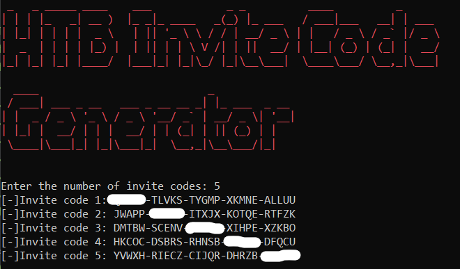

# HTB Invite code Generator
HTB invite code generator

## WARNING 
* This script was only created for learning and not intended to ruin the process to reginster in HTB

## Working
* This is basically a web crawler which will send `n` post request to HTB Using the User-Agent header which will be loaded as a json format and then the result will scrape the Invite code i.e which is in base64. Those codes will be decoded to plain text and displayed

## Requirements
* Python 3.X
* pyBase should be insatlled on your system `pip install pybase`
* pyfiglet should be insatlled on your system `pip install pyfiglet`
* termcolor should be insatlled on your system `pip install termcolor`

## Note
* for the program to run successfully open the CMD/Terminal and type the following command `pip install -r requirements.txt` or you can install manually 

## Author
* Bhaskar Pal - *Initial Work* - [bhaskarpal](https://github.com/onyx-storm) 

## License
* This project is licensed under the MIT License - see the [LICENSE.md](LICENSE) file for details

## Acknowledgments
* Base code created by the help of [Sankethj](https://github.com/sankethj/hackthebox) 

